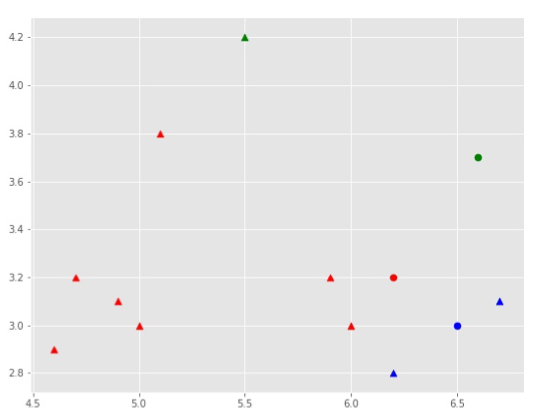

# Image-Color-Quantization-using-K-means-Clustering
This is a project completed by me for Computer Vision and Image Processing course during my MS at University at Buffalo
  
The main goal of this project is to develop a strong understanding regarding the various concepts of processing the image such as Morphology and Image Segmentation, Point Detection, Hough transform and then using these concepts accomplish tasks such as Line & Coins Detection. It also aims at allowing the student to develop a strong understanding regarding how the basic operations like Updating Centroids in K-means Clustering work at a unit level.

## K-Means Clustering Algorithm

K-Means is one of the simplest unsupervised learning algorithms that solve the clustering problems. The procedure follows a simple and easy way to classify a given data set through a certain number of clusters (assume k clusters). The main idea is to define k centers, one for each cluster.

### Algorithm
To start with k-means algorithm, you first have to randomly initialize points called the cluster centroids (K). K-means is an iterative algorithm and it does two steps: 1. Cluster assignment 2. Move centroid step. 
**1. Cluster assignment**
The algorithm goes through each of the data points and depending on which cluster is closer, It assigns the data points to one of the three cluster centroids.

**2. Move centroid**

Here, K-means moves the centroids to the average of the points in a cluster. In other words, the algorithm calculates the average of all the points in a cluster and moves the centroid to that average location. 
This process is repeated until there is no change in the clusters (or possibly until some other stopping condition is met). K is chosen randomly or by giving specific initial starting points by the user.

Based on the steps I developed a K-Mean Clustering Algorithm from scratch and the clustering process had following output: 

 

 

 

 
## Color Quantization

Color quantization is the process of reducing the number of distinct colors used in an image. The main reason we may want to perform this kind of compression is to enable the rendering of an image in devices supporting only a limited number of colors (usually due to memory limitations). 

Obviously all compressions come with a cost. In this case the resulting image may differ too much from the original one. Hence the goal of the color quantization is to obtain a compressed image as similar as possibile to the original one. The key factor for achieving this is the selection of the color palette by choosing the colors that most summarizes the original image. 

The most common techniques reduce the problem of color quantization into a clustering problem of points where each point represents the color of a pixel. It consists in creating the palette by selecting a representative point for each cluster. After that the compression simply remaps all the colors into their cluster representative. As you may guess the resulting palette highly depends on the color space and distance metric used. 

Before digging into the palette selection in more detail here's a simple and brief introduction about color spaces and color difference. The idea is to give a grasp on some concepts that are necessary to understand what comes next without being too much detailed as a more detailed explanation is out of the scope of this post. Feel free to skip these parts if you already know what they're talking about. 

In this project I was given a input image of a baboon and the resultant quantized images using number of clusters(k), where k=3, k=5, k=10 and k=20 respectively;

 

 
